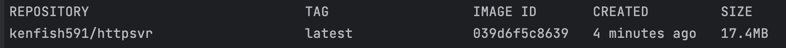
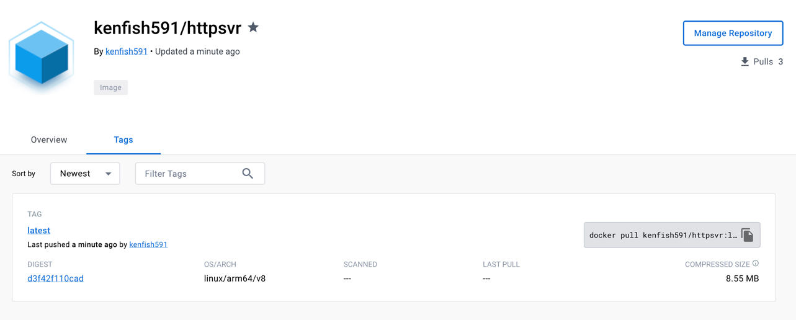
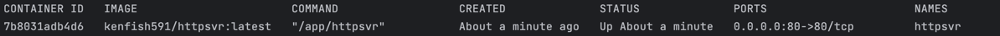
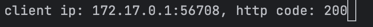
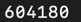
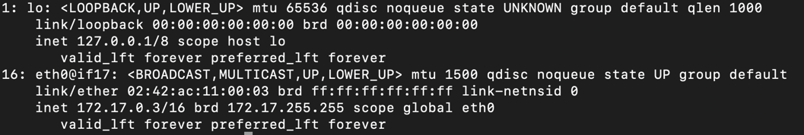

### 编写 Dockerfile 将模块二作业编写的 httpserver 容器化

```sh
FROM golang:1.17-alpine3.14 AS build
LABEL authors="kenfish591"

# 设置工作目录
WORKDIR /app

# 将当前目录的内容复制到工作目录
COPY . .

RUN go build -o httpsvr httpsvr.go

# 更改为使用轻量级的 alpine 基础镜像
FROM alpine:3.14

# 将编译好的程序复制到新的镜像中
COPY --from=build /app/httpsvr /app/httpsvr

RUN chmod +x /app/httpsvr

CMD ["/app/httpsvr"]
```

### 构建本地镜像
```sh
docker build -t kenfish591/httpsvr .
```
### 查看镜像
```sh
docker images
```


### 将镜像推送至 docker 官方镜像仓库
```sh
docker push kenfish591/httpsvr:latest
```


### 通过 docker 命令本地启动 httpserver
```sh
docker run -p 80:80 --name httpsvr kenfish591/httpsvr:latest
```

### 查看容器
```sh
docker ps
```


### 功能测试
浏览器访问http://localhost/，终端输出客户端ip和返回码


### 查询容器的进程ID
```sh
docker inspect --format '{{ .State.Pid }}' httpsvr
```


### 通过 nsenter 进入容器查看 IP 配置
```sh
nsenter -t 604180 -n ip addr
```
